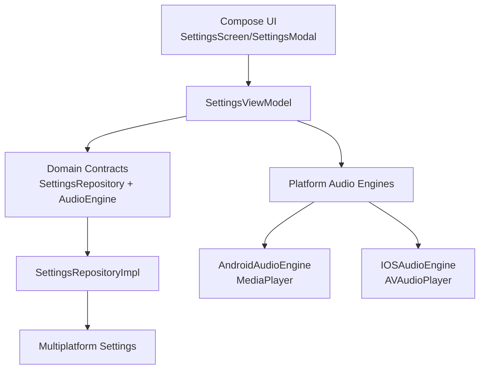
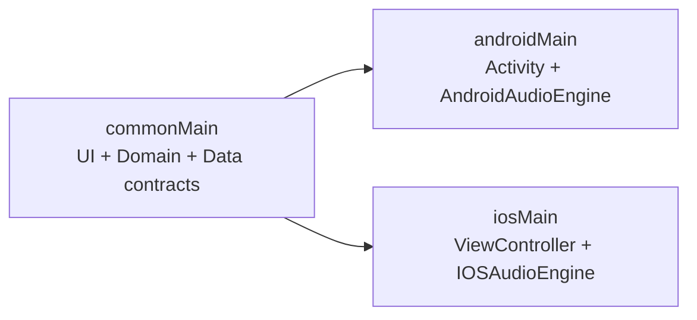
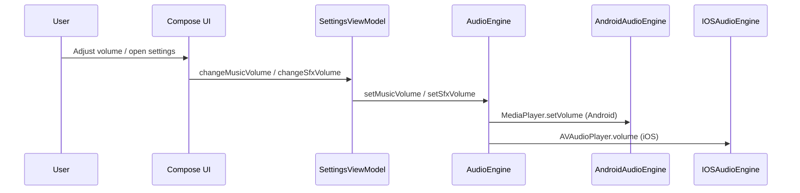

# GameApp

## Overview
GameApp is a Kotlin Multiplatform (KMP) project with shared UI and business logic for Android and iOS.
The current application focuses on a settings flow for game configuration, including:

- Sound effects volume
- Music volume
- Language selection

The project is intentionally small and demonstrates a clean baseline for scaling a multiplatform architecture without introducing unnecessary complexity.

## Why This Architecture
This project uses a lightweight Clean Architecture-inspired organization to balance simplicity and maintainability:

- **Domain-first contracts** (`SettingsRepository`, `AudioEngine`) define what the app needs, not how it is implemented.
- **Data implementation isolated** (`SettingsRepositoryImpl`) keeps persistence details out of UI logic.
- **Presentation layer isolated** (`SettingsViewModel` + composables) handles state and interactions.
- **Thin platform entry points** (`androidMain`, `iosMain`) only compose dependencies and bootstrap UI.

This structure was chosen because the app is small, but still benefits from clear boundaries that make future growth safe and predictable.

## Kotlin Multiplatform Structure

```text
composeApp/
 └── src/
     ├── commonMain/
     │   ├── kotlin/com/example/gameapp/
     │   │   ├── domain/
     │   │   ├── data/
     │   │   └── presentation/
     │   └── composeResources/
     ├── commonTest/
     ├── androidMain/
     └── iosMain/
```

### Responsibilities
- `commonMain`: shared domain models, repository contracts, data implementation using multiplatform storage, ViewModel, and Compose UI.
- `commonTest`: multiplatform unit tests for shared business behavior.
- `androidMain`: Android entry point (`MainActivity`) and Android audio engine implementation.
- `iosMain`: iOS entry point (`MainViewController`) and iOS audio engine implementation.

## Architecture
The app follows layered responsibility separation:

1. **Presentation**: `SettingsScreen`/`SettingsModal` render UI, `SettingsViewModel` orchestrates state updates.
2. **Domain**: `SettingsModel`, `Language`, `SettingsRepository`, `AudioEngine` define core rules/contracts.
3. **Data**: `SettingsRepositoryImpl` persists and retrieves settings with `Multiplatform Settings`.

Data flow:

`UI -> ViewModel -> Repository Interface -> Repository Implementation -> Storage`

Audio side effects:

`UI -> ViewModel -> AudioEngine Interface -> Platform AudioEngine (Android/iOS)`

## Design Patterns Used
- **Repository Pattern**: `SettingsRepository` abstraction with `SettingsRepositoryImpl`.
- **State Management (Unidirectional)**: ViewModel exposes `StateFlow<SettingsModel>`; UI observes and dispatches intents.
- **Dependency Inversion**: ViewModel depends on interfaces (`SettingsRepository`, `AudioEngine`), not concrete platform classes.
- **Composition Root per platform**: platform entry points instantiate concrete dependencies and wire shared UI.

## Multiplatform Strategy
- **Shared code (`commonMain`)**
  - Domain models and contracts
  - Settings persistence logic
  - ViewModel and Compose UI
- **Platform-specific code**
  - Audio playback engine (`MediaPlayer` on Android, `AVAudioPlayer` on iOS)
  - App entry points / lifecycle bootstrap
- **Expect/actual usage**
  - Not currently required. Platform differences are encapsulated via interfaces and per-platform implementations, which is enough for current scope.

## Tech Stack
- Kotlin Multiplatform
- Compose Multiplatform
- Kotlin Coroutines + Flow
- AndroidX Lifecycle ViewModel (multiplatform artifacts)
- Multiplatform Settings (`com.russhwolf:multiplatform-settings`)
- Android MediaPlayer
- iOS AVFoundation (`AVAudioPlayer`)

## Testing Strategy
Current tests are in `commonTest` and should prioritize shared domain behavior first.

Recommended testing focus for this architecture:
- domain rules (`Language` transitions, model invariants)
- ViewModel state transitions (without platform framework dependencies)
- repository behavior with controlled storage doubles

The project now includes basic shared tests for language cycling behavior, replacing placeholder assertions.

## How to Run

### Android
- Via Android Studio run configuration, or:

```bash
./gradlew :composeApp:assembleDebug
```

### iOS
- Open `iosApp` in Xcode and run the target on simulator/device.
- You can also build from Gradle when needed for CI pipelines.

### Shared module checks
- Run shared tests:

```bash
./gradlew :composeApp:allTests
```

## Minimal Architectural Improvements Applied
During the architecture review, only safe and minimal refactors were applied (no feature additions):

- Moved audio init/release lifecycle handling to shared UI composition lifecycle to keep platform entry points thinner and avoid unreleased audio resources on iOS.
- Hardened settings loading against invalid persisted language values to avoid runtime crashes.
- Replaced hard-coded persistence keys with internal constants for maintainability.
- Removed duplicated `compose.resources` block in Gradle script.
- Improved readability in UI code (explicit imports, clearer parameter passing).
- Replaced placeholder test with meaningful domain-oriented tests.

## Future Improvements (Optional)
- Introduce dedicated UseCase classes if business rules grow.
- Add ViewModel unit tests with fake repository/audio engine.
- Add static analysis (ktlint/detekt) and CI quality gates.
- Introduce DI framework only when constructor graph and module count justify it.

## System Design
This project uses **Kotlin Multiplatform + Compose Multiplatform** to share UI, domain logic, and core application behavior across Android and iOS.

Current architecture goals:
- maximize code sharing without coupling `commonMain` to platform APIs;
- keep platform-specific optimizations in the infrastructure layer;
- preserve clear separation of responsibilities (presentation, domain, data, and platform);
- enable incremental growth without structural rewrites.

## Architecture Overview
The architecture follows a **lightweight Clean Architecture + multiplatform UI** model:

- **Presentation Layer**
  - Composables (`SettingsScreen`, `SettingsModal`, visual components)
  - `SettingsViewModel` as the state and UI action orchestrator
- **Domain Layer**
  - Entities and contracts (`SettingsModel`, `Language`, `SettingsRepository`, `AudioEngine`)
  - Shared business rules across platforms
- **Data/Platform Layer**
  - `SettingsRepositoryImpl` for multiplatform persistence
  - Target-specific audio engines (`AndroidAudioEngine`, `IOSAudioEngine`)
  - Thin platform entry points (`MainActivity`, `MainViewController`)

## Project Structure
```text
composeApp/
├── src/
│   ├── commonMain/
│   │   ├── kotlin/com/example/gameapp/
│   │   │   ├── presentation/
│   │   │   ├── domain/
│   │   │   └── data/
│   │   └── composeResources/
│   │       ├── drawable/
│   │       ├── values/
│   │       ├── values-pt|es|fr/
│   │       └── files/                # shared audio assets (.mp3)
│   ├── androidMain/
│   │   ├── kotlin/com/example/gameapp/
│   │   │   ├── MainActivity.kt
│   │   │   └── audio/AndroidAudioEngine.kt
│   └── iosMain/
│       ├── kotlin/com/example/gameapp/
│       │   ├── MainViewController.kt
│       │   └── audio/IOSAudioEngine.kt
```

Responsibilities:
- `commonMain`: shared logic, state, and UI.
- `androidMain`: Android integration (Activity and audio with `MediaPlayer`).
- `iosMain`: iOS integration (UIViewController and audio with `AVAudioPlayer`).
- `composeResources`: single source of shared resources (strings, drawables, and audio files).

## Kotlin Multiplatform Strategy
- **`commonMain`**: concentrates shared contracts, state, and UI.
- **`androidMain` / `iosMain`**: implement native platform details.
- **Expect/actual**: the project currently uses **domain interfaces + per-platform implementations** (without `expect/actual`), which keeps coupling low and testability high for this scope.

## Component Architecture
Main components and interactions:
- `SettingsScreen` opens/closes the modal and controls screen lifecycle.
- `SettingsModal` renders volume and language controls.
- `SettingsViewModel` centralizes state (`StateFlow`) and commands.
- `SettingsRepository` abstracts persistence.
- `AudioEngine` abstracts platform audio playback.

## Data Flow
Main functional flow:

`User Interaction -> Composable -> SettingsViewModel -> Domain Contracts -> Repository/AudioEngine -> Platform APIs`

Persistence flow:

`UI Event -> ViewModel.update -> SettingsRepository.saveSettings -> Multiplatform Settings`

Read flow:

`Repository.getSettings -> Flow<SettingsModel> -> ViewModel.uiState -> UI recomposition`

## UI Architecture
The UI is built with Compose Multiplatform in `commonMain`:
- declarative composition with reusable Composables;
- unidirectional state driven by `StateFlow`;
- layout component separation (`HeaderSection`, `LanguageSelector`, `SettingSliderItem`, `ExitButton`) for local maintainability and incremental evolution.

## Resource System
The project uses Compose Multiplatform Resources with a public `Res` class.

Key points:
- strings and drawables are accessed via `Res.string.*` and `Res.drawable.*`;
- shared binary resources (audio) are stored in `composeResources/files`;
- file access uses `Res.getUri("files/...")` for native player integration.

## Audio System
Current audio architecture:
- shared contract: `AudioEngine` (`initialize`, `release`, `setMusicVolume`, `setSfxVolume`);
- Android: `AndroidAudioEngine` with `MediaPlayer`;
- iOS: `IOSAudioEngine` with `AVAudioPlayer`;
- shared audio files: `test_music.mp3` and `test_sfx.mp3`.

Flow:
`UI -> SettingsViewModel -> AudioEngine -> platform implementation -> native player`

## Architecture Diagram


## Multiplatform Flow Diagram


## Audio Flow Diagram


## Design Decisions
- Kotlin Multiplatform to share domain, state, and UI across platforms.
- Compose Multiplatform to reduce UI divergence between Android and iOS.
- Domain contracts (`SettingsRepository`, `AudioEngine`) to decouple ViewModel from implementations.
- Native audio implementations to use stable and performant platform APIs.
- Centralized shared resources to reduce cross-target inconsistencies.

## Scalability Considerations
The current architecture supports non-disruptive evolution:
- adding new domain use cases without changing existing infrastructure;
- expanding screens by reusing the `Composable + ViewModel + contracts` pattern;
- future modular extraction (`core`, `feature-settings`, `platform-audio`) without rewriting core flows;
- adding new KMP targets with low impact when `commonMain` and native source-set boundaries are preserved.